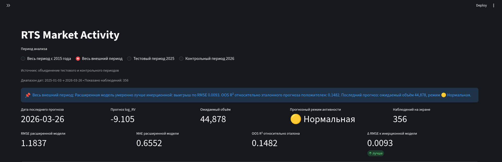
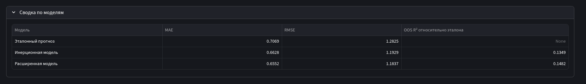
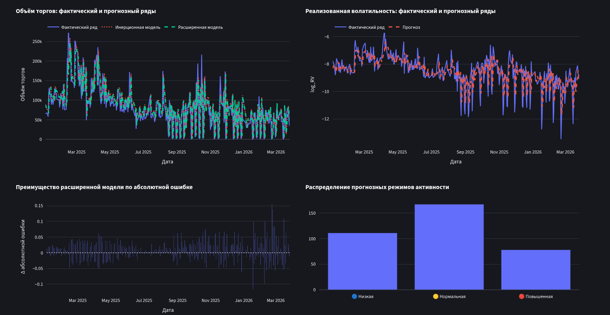
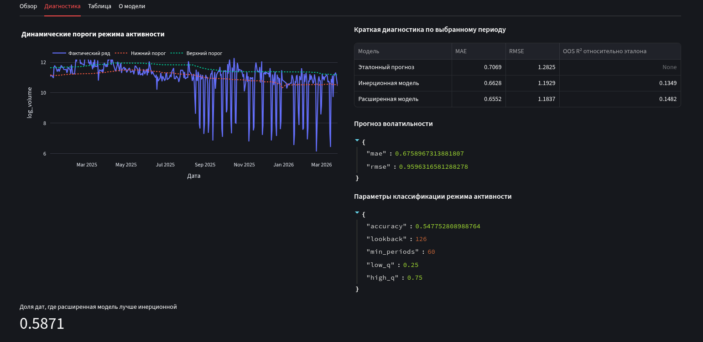
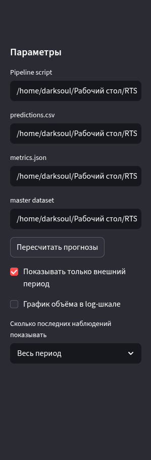
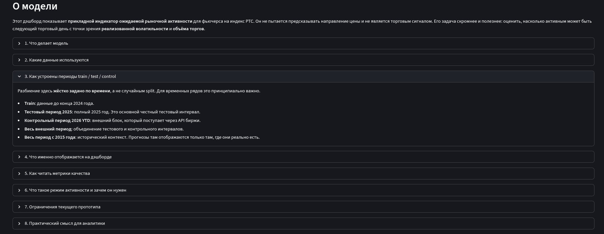

# RTS Market Activity Forecasting

English | [Русская версия](docs/README_RU.md)

Research prototype for forecasting expected market activity in RTS index futures.  
The repository combines:

- realized volatility forecasting,
- trading volume forecasting,
- activity regime classification,
- and a Streamlit dashboard for model inspection.

The modeling setup is intentionally simple and interpretable: first forecast `log_RV`, then use that forecast as an additional input for next-day volume prediction.

This public version ships with a compact sample master dataset instead of the full historical research file:

- period: `2023-01-03` to `2026-01-06`,
- rows: `796`,
- columns: `date`, `log_RV`, `volume_day`.

## What This Repository Does

This project is not a trading bot and does not predict price direction.

Its scope is narrower and more practical:

- estimate whether the next trading day is likely to be quiet or active,
- forecast daily `log_RV`,
- forecast daily `log_volume`,
- compare a persistence-style baseline with a volatility-augmented model,
- inspect the results through a reproducible pipeline and dashboard.

## Dashboard Preview

### Video demo


Direct file: [dashboard-demo.gif](images/dashboard-demo.gif)

### Main dashboard



### Model comparison





### Diagnostics



### Navigation and controls




### About tab



## Repository Structure

```text
.
├── app.py
├── moex_api.py
├── moex_contract_segments.json
├── requirements.txt
├── rts_activity_pipeline.py
├── update_data.py
├── docs/
│   ├── DATA.md
│   ├── METHODOLOGY.md
│   ├── PROJECT_STRUCTURE.md
│   ├── README_RU.md
│   └── RESULTS.md
├── images/
│   ├── about.png
│   ├── dashboard-demo.gif
│   ├── dashboard-demo.webm
│   ├── diagnostic-info.png
│   ├── main-info.png
│   ├── model-stat.png
│   ├── model-viz.png
│   ├── side-bar.png
│   └── switcher.png
├── RTS_daily_RV_sample.csv
├── moex_control_daily.csv
└── rts_activity_outputs/
```

The repository is intentionally organized around a lightweight sample dataset so it can be published and cloned without heavyweight market history.

## Data and Modeling Flow

1. The master dataset is loaded from `RTS_daily_RV_sample.csv`.
2. The control sample is optionally refreshed from MOEX ISS into `moex_control_daily.csv`.
3. `rts_activity_pipeline.py` merges datasets, creates lagged features, runs expanding-window forecasts, and writes outputs.
4. `app.py` loads `predictions.csv` and `metrics.json` from `rts_activity_outputs/` and visualizes the results.

Current pipeline configuration:

- training ends on `2024-12-31`,
- test period covers `2025`,
- control period starts on `2026-01-01`,
- lags are `1`, `2`, and `5`,
- initial warm-up window is `252` trading days.

The public sample master dataset keeps only the fields that are actually used by the current baseline pipeline:

- `date`
- `log_RV`
- `volume_day`

## Quick Start

### 1. Install dependencies

```bash
python -m venv .venv
source .venv/bin/activate
pip install -r requirements.txt
```

On Windows:

```bash
.venv\Scripts\activate
pip install -r requirements.txt
```

### 2. Refresh the control sample

```bash
python update_data.py
```

### 3. Run the forecasting pipeline

```bash
python rts_activity_pipeline.py
```

### 4. Launch the dashboard

```bash
streamlit run app.py
```

## Core Files

- `app.py` runs the Streamlit dashboard.
- `rts_activity_pipeline.py` contains the feature engineering, forecasting, and metric calculation logic.
- `update_data.py` downloads and aggregates MOEX ISS candles for the control sample.
- `moex_api.py` provides a minimal MOEX ISS client with explicit error handling.

## Public Sample Results

Metrics below come from the reduced public sample master dataset plus the MOEX control block:

### RV forecast

| Period | MAE | RMSE |
|---|---:|---:|
| Test (2025) | 0.6436 | 0.8947 |
| Control (2026) | 0.7444 | 1.1107 |
| All OOS | 0.6640 | 0.9424 |

### Volume forecast, full model

| Period | MAE | RMSE | OOS R² vs naive |
|---|---:|---:|---:|
| Test (2025) | 0.5761 | 1.0268 | 0.2692 |
| Control (2026) | 0.8316 | 1.3241 | 0.2823 |
| All OOS | 0.6278 | 1.0935 | 0.2731 |

### Activity regime accuracy

| Period | Accuracy |
|---|---:|
| Test (2025) | 0.5704 |
| Control (2026) | 0.6389 |
| All OOS | 0.5843 |

